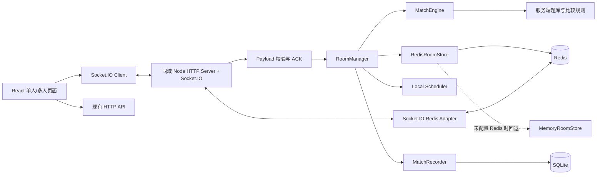
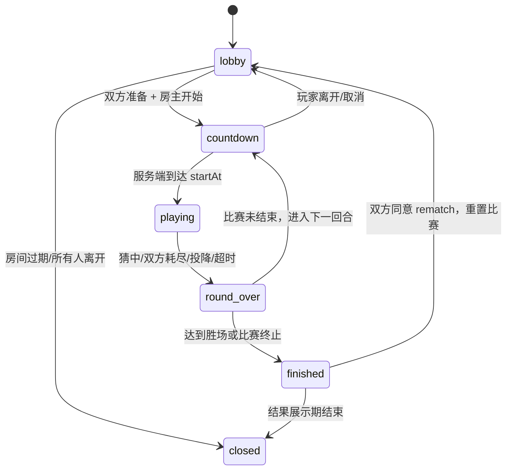
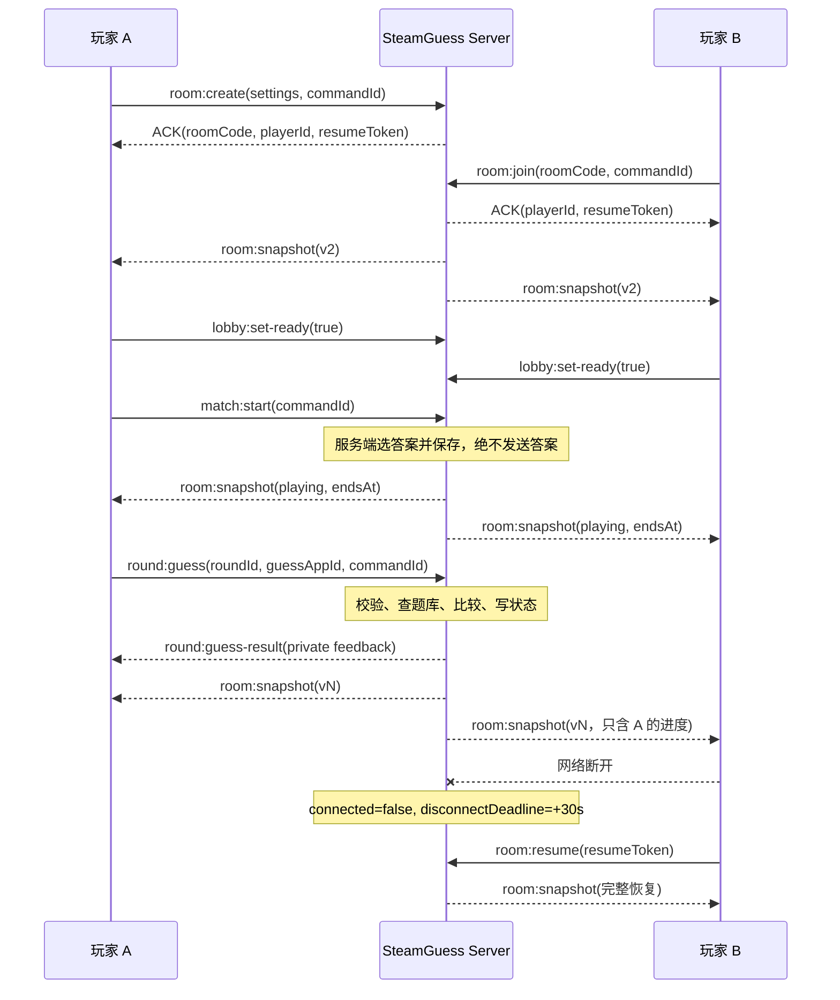

# SteamGuess 多人模式调研与落地方案

> 状态：MVP 与同机多 Node Redis 扩展已实现，待线上反向代理与真实浏览器验证
> 调研日期：2026-08-05
> 实施更新：2026-08-16
> 目标仓库：[TraceOnSnow/SteamGuess](https://github.com/TraceOnSnow/SteamGuess)
> 参考仓库：[kennylimz/anime-character-guessr](https://github.com/kennylimz/anime-character-guessr)、[shnlfriberg/csgofriberg](https://github.com/shnlfriberg/csgofriberg)

## 实施记录

本方案已经在当前工作区完成 MVP 与 Redis 扩展，范围为 2–8 人私人房间、BO1/BO3/BO5、服务端权威猜测、重连宽限、回合倒计时、超时补偿调度、SQLite 完赛记录、Redis `RoomStore`、Socket.IO Redis Adapter、分布式房间锁和跨 Node 实例恢复。未配置 Redis 时仍可使用单进程 `MemoryRoomStore` 作为本地回退。

当前 Redis 只承担活动比赛状态，不启用磁盘持久化；Redis 或整机重启会结束活动房间。SQLite 完赛记录在 Redis 权威状态提交后 best-effort 写入，进程若恰好在两者之间崩溃，历史记录可能缺失。排行榜上线前需要补结果 outbox/重试机制。截图提示、个人库题池、匹配、排行榜和聊天仍不属于当前多人范围。

本地发布验证已通过 `npm run release:check`，其中包括前端测试、Node API/多人测试、79 项数据流水线测试、生产构建和发布预检。Redis 专项测试使用真实 Redis，覆盖陈旧写入 fencing 和两个 Node 实例共享同一权威房间。

---

## 1. 结论先行

以下是最初的 MVP 路线；其中共享房间状态阶段已经于 2026-08-16 落地：

1. **产品形态先做“1v1 私人房间、同题竞速、BO1/BO3/BO5”**，底层数据结构预留 2–8 人，不在首版同时做匹配、排行榜、聊天、观战和大型公开房间。
2. **在现有 Node HTTP Server 上直接挂载 Socket.IO**，继续维持一个应用、一个端口、同域部署，不先拆微服务。
3. **服务端权威**：答案选择、题库过滤、猜测校验、属性比较、回合计时、胜负结算全部在服务端完成。客户端只提交 `guessAppId`，不能上报“我猜对了”或自行结算。
4. **活动房间实时状态保存在 Redis，SQLite 保存已经结束的比赛与回合记录**。未配置 Redis 时使用 `MemoryRoomStore` 本地回退；当前不承诺 Redis/整机重启后的活动房间恢复。
5. **重连身份不能依赖 Socket ID、用户名或头像**。应使用稳定 `playerId` 加服务端签发的随机 `resumeToken`；Socket ID 只代表本次连接。
6. **活动回合中绝不向浏览器发送答案，即使是“加密答案”也不发送**。浏览器里存在的密钥无法提供真正保密性。
7. **多人首版关闭截图提示与“是否拥有”线索**：当前截图 URL 包含 Steam AppID，可直接泄露答案；“是否拥有”依赖每位玩家各自本地游戏库，不适合作为共享竞技规则。
8. **借鉴两个参考项目的设计，不直接复制其源码**。前者声明 CC BY-NC 4.0，带非商业限制；后者为 AGPL-3.0。SteamGuess 当前快照未发现根目录 `LICENSE`，正式吸收外部代码前应先明确自身许可证策略。

一句话概括：**复用当前单体部署和服务端权威实时层，用 Redis 支持同机多 Node 扩展，但暂不引入 PostgreSQL、匹配和长期恢复等更重基础设施。**

---

## 2. 调研范围与代码快照

本报告以三个仓库 `main` 分支在 2026-08-05 的代码为准：

| 仓库 | 调研快照 | 重点文件 |
|---|---:|---|
| `kennylimz/anime-character-guessr` | `5272039` | `client/src/pages/Multiplayer.jsx`、`server/utils/socket.js`、`server/server.js` |
| `shnlfriberg/csgofriberg` | `bc2287c` | `server/src/socket/index.ts`、`server/src/services/roomStore.ts`、`server/src/index.ts` |
| `TraceOnSnow/SteamGuess` | `12c16e0` | `src/App.tsx`、`src/engine/ComparisonEngine.ts`、`src/components/GameTable/GameTable.tsx`、`server/index.js`、`server/api.js`、`server/database.js` |

仓库后续可能继续变化，因此实施时应重新确认关键文件，但本报告中的架构判断不依赖某个小版本的具体语法。

---

## 3. SteamGuess 当前状态：哪些能复用，哪些必须改变

### 3.1 当前链路

当前单人模式主要在浏览器中完成：

- `src/App.tsx` 在前端加载完整题库并随机选择 `currentGame`。
- 玩家选择游戏后，前端调用 `ComparisonEngine.compare(guessedGame, currentGame)` 生成结果。
- `GameTable` 还会拿到完整 `correctGame`，在浏览器中计算厂商、标签、“是否拥有”等额外线索。
- 对局结束后，客户端通过 `/api/sessions/complete` 把 `answerAppId`、`outcome`、`guesses` 等结果上报给服务端。
- `getPlayerId()` 只是保存在 `localStorage` 的客户端随机 ID，适合匿名统计，但不能当作多人身份凭证。

这套结构对单人游戏没有问题，因为作弊只影响玩家自己；但多人模式若照搬，会产生三个根本问题：

1. 客户端知道答案，无法公平对战。
2. 客户端可以伪造正确结果、回合状态和结算。
3. 每个客户端可能使用不同设置、不同题库或不同本地游戏库，无法保证同一局规则一致。

### 3.2 可以直接复用的部分

- `SearchBox`：仍可在本地题库中做搜索和自动补全，提交时只发送 `appId`。
- `GameTable` 的大部分展示样式与反馈颜色。
- `Game` 数据结构、难度分级、题库发布流程。
- 价格、活跃度、评测、发行日期等比较规则。
- i18next、多语言资源、现有 CSS 设计语言。
- Node HTTP Server、SQLite、Docker Compose、健康检查与现有发布检查流程。
- `players`、`game_sessions` 的匿名玩家和历史统计思路。

### 3.3 必须调整的部分

| 当前实现 | 多人模式处理 |
|---|---|
| 浏览器随机选答案 | 服务端从服务端题库中选答案 |
| 浏览器持有完整 `correctGame` | 活动回合中答案仅存在服务端私有状态 |
| 浏览器计算全部反馈 | 服务端计算并发送经过裁剪的反馈 DTO |
| 客户端上报结果 | 服务端直接写入权威比赛记录 |
| Socket ID / 用户名可视为玩家 | 使用稳定玩家身份和 `resumeToken` |
| 每个玩家独立设置显示字段 | 影响线索的信息由房主设置并成为房间规则 |
| 本地“我的游戏库”模式 | 不进入首版多人规则 |
| 直接把截图 URL 发给浏览器 | 首版关闭，后续使用不暴露上游 URL 的代理 |

### 3.4 生产镜像的隐藏改造点

当前运行时镜像只复制 `dist/`、`server/` 和 `package.json`，没有生产 `node_modules`。这是因为现有服务端基本只使用 Node 内置模块。

加入 `socket.io` 后必须同步修改 Dockerfile，例如在 runtime 阶段执行：

```dockerfile
COPY package.json package-lock.json ./
RUN npm ci --omit=dev
```

或者从构建阶段复制经过裁剪的生产依赖。否则本地可以运行、生产镜像会因找不到 `socket.io` 而启动失败。

服务端题库应从生产镜像中真实存在的 `dist/games_demo.json` 加载，而不是依赖不会被复制进 runtime 的 `src/` 或原始 `public/`。

---

## 4. 参考项目一：anime-character-guessr

### 4.1 架构概览

当前分支采用：

- React 客户端；
- Node/Express 服务端；
- Socket.IO 实时通信；
- MongoDB 处理部分持久化数据；
- 实时房间、玩家和计时器主要保存在服务端进程内的 `Map`；
- 一个体量很大的 `server/utils/socket.js` 处理建房、加入、准备、房主、旁观、猜测、计时、断线和重连等功能。

它已经实现了相当完整的多人功能，包括公开房间、快速加入、房主设置、旁观、同步模式、队伍、全局禁选、房主转移和断线恢复。

### 4.2 值得借鉴的做法

#### 服务端重新判断是否猜对

客户端提交猜测后，服务端根据猜测角色 ID 与答案 ID 重新计算 `isCorrect`，而不是相信客户端传来的结果。这是多人游戏最基本、也是最重要的边界。

#### 统一由服务端处理超时

项目为玩家或队伍记录 deadline/token，并由服务端定时器触发超时结算。即使客户端倒计时卡顿或被修改，最终结果仍由服务端决定。

#### 重连时发送完整快照

玩家断线重连后，服务端会迁移旧 Socket 引用，并重新发送当前游戏、猜测历史、标签禁用状态、同步进度等快照。这比让客户端尝试重放零散事件更可靠。

#### 对命令使用 ACK

建房、加入、猜测和设置等操作通过 Socket.IO ACK 返回成功或错误，客户端可以明确知道一次命令是否被服务端接受。

#### 权限在服务端检查

开始游戏、修改设置、踢人和转移房主等操作都由服务端确认操作者身份，不只依赖客户端隐藏按钮。

### 4.3 不建议照搬的部分

#### 加密答案仍发送到了客户端

该项目在 `gameStart` 中把加密后的答案发送给客户端，客户端代码中同时包含 AES 解密密钥和解密逻辑。这样做可以避免答案直接出现在普通日志中，但不能防止玩家通过 DevTools、构建产物或事件监听拿到答案。

SteamGuess 应采用更简单、更安全的原则：**回合结束前，答案对象和答案 AppID 都不进入客户端。**

#### 房间只在进程内存中

服务端重启会丢失全部活动房间；多实例部署时，各实例也看不到彼此的房间。这个方案适合单实例首版，但必须明确其边界。

#### 身份恢复偏弱

重连主要依赖用户名、头像和 Socket 引用迁移。用户名和头像不是可靠凭证，容易发生冒名或错误绑定。SteamGuess 应使用服务端随机令牌。

#### 单文件承担太多责任

`socket.js` 同时承担传输层、权限、状态机、规则、存储、计时和广播，后续功能越多越难测试。SteamGuess 应从一开始拆成协议、房间、比赛引擎、存储和调度五层。

#### 客户端页面状态过于集中

多人页面包含大量事件监听和本地状态，容易出现事件乱序、重复监听和状态互相覆盖。SteamGuess 应以“服务端快照 + revision”为主，而不是让每个事件直接修改多个 React state。

### 4.4 对 SteamGuess 的结论

这个项目适合参考“如何快速做出可玩的多人房间”，尤其是：

- ACK；
- 服务端权限；
- 服务端计时；
- 重连快照；
- 房主转移；
- 集成测试。

但不应复制它的答案传输方式、弱身份绑定和超大 Socket 处理文件。

---

## 5. 参考项目二：csgofriberg

### 5.1 架构概览

该项目是更完整的生产化方案：

- React + TypeScript 客户端；
- Express + Socket.IO 服务端；
- PostgreSQL 保存账号、统计和比赛记录；
- Redis 保存房间快照、身份索引、匹配队列、定时任务与连接信息；
- Socket.IO Redis Adapter 支持跨实例广播；
- Redis 分布式锁串行化同一房间的并发修改；
- Redis Sorted Set 保存可恢复的回合超时、断线判负和房间清理任务；
- Redis Stream/队列重试比赛结果持久化；
- Zod 校验 Socket payload；
- 房间状态带 `revision/stateVersion`；
- 具备 Socket 集成测试、房间存储测试和负载测试脚本。

### 5.2 值得借鉴的做法

#### 连接和身份分离

玩家有稳定 identity key，Socket ID 只是当前连接。断线后换一个 Socket，仍然可以恢复到同一个玩家状态。

#### 明确的房间状态机

房间状态被限制为 `waiting / starting / playing / round_over / finished`，而不是散落的多个布尔值。这使权限、超时和结算条件更容易验证。

#### 绝对时间点而非客户端倒计时

房间保存 `roundEndsAt`、`nextRoundAt`、`disconnectDeadline`。客户端只根据服务端时间点显示倒计时；最终到期判断始终在服务端。

#### revision 与可见性裁剪

每次房间写入递增 revision，客户端可以忽略旧快照或发现 patch 缺口。活动回合中，每位玩家只看到自己的完整猜测；其他玩家的具体猜测会被隐藏，答案只在回合或比赛结束后公开。

#### 房间锁与陈旧写入保护

单实例时使用本地 Promise 队列，多实例时使用 Redis 锁；保存时还检查 revision，避免两个并发操作互相覆盖。

#### 定时任务可恢复

定时任务不仅依赖本地 `setTimeout`，还写入 Redis 调度集合。某个实例重启后，其他实例仍可领取并执行到期任务。

#### 面向故障的测试

测试覆盖断线、重连、并发猜测、房间回收、重复事件和负载，而不仅是正常建房流程。

### 5.3 不应在 SteamGuess 首版全部照搬的原因

完整引入 Redis、PostgreSQL、分布式锁、任务领取、消息流和多实例广播，会显著增加：

- 本地开发依赖；
- 部署与备份复杂度；
- 故障类型；
- 测试成本；
- 对当前单机 SQLite 架构的改造范围。

SteamGuess 已经选择性落地 Redis RoomStore、Redis Adapter 和分布式房间锁，但仍未引入 PostgreSQL、Redis Stream/outbox、自动匹配和完整持久化调度。原则仍是借鉴它的**边界和数据模型**，而不是复制全部基础设施。

### 5.4 对 SteamGuess 的结论

应当从第一天借鉴：

- 稳定身份；
- 房间状态机；
- 绝对 deadline；
- payload 校验；
- 房间 revision；
- 串行房间 mutation；
- 私有/公开视图分离；
- 可替换 RoomStore；
- 集成与负载测试。

已经实施：

- Redis RoomStore；
- Socket.IO Redis Adapter；
- Redis 分布式房间锁和 fencing；
- 跨 Node 实例共享房间与断线恢复；

仍应延后到出现真实产品需求后再做：

- 跨 Redis/整机重启的持久房间恢复；
- 可靠结果 outbox/重试；
- 自动匹配队列；
- PostgreSQL；
- 排行榜与长期统计。

---

## 6. 两个参考项目对比

| 维度 | anime-character-guessr | csgofriberg | SteamGuess 建议 |
|---|---|---|---|
| 实时通信 | Socket.IO | Socket.IO | Socket.IO |
| 活动房间 | 单进程 Map | Redis，含本地降级 | RedisRoomStore，未配置时回退 MemoryRoomStore |
| 数据库 | MongoDB + 内存房间 | PostgreSQL + Redis | Redis 保存活动状态，SQLite 记录结果 |
| 权威判定 | 服务端重新判定 | 服务端完整判定 | 必须服务端判定 |
| 答案保密 | 加密后仍发客户端 | 回合结束后才公开 | 不发送答案，结束后再 reveal |
| 身份 | 用户名/头像/Socket 迁移 | 稳定身份与会话 | playerId + 服务端 resumeToken |
| 重连 | 快照恢复 | 身份索引、deadline、快照 | 30 秒宽限 + 快照 |
| 并发控制 | 主要依赖单进程事件顺序 | 房间锁 + revision | Redis 锁/fencing + revision；内存模式使用本地锁 |
| 定时器 | 进程内 timer | Redis 可恢复调度 + 本地 timer | 绝对 deadline + 本地 timer + 跨实例周期核对 |
| 状态同步 | 多个细粒度事件 | snapshot/patch + version | 首版完整 snapshot，后续再 patch |
| payload 校验 | 手工校验 | Zod | 推荐 Zod或等价 schema |
| 测试 | 有多人集成测试 | 单元、集成、负载、基准 | 至少单元 + 双客户端集成 + 简单负载 |
| 复杂度 | 中 | 高 | 首版控制在中低 |

---

## 7. 建议的第一版玩法

### 7.1 模式定义

**1v1 同题竞速**：

- 两名玩家进入同一私人房间；
- 房主设置难度与 BO1/BO3/BO5；
- 双方准备后由房主开始；
- 服务端从相同题池中选择一个答案；
- 每位玩家有 10 次猜测机会；
- 每回合固定服务端倒计时，建议先采用 120 秒；
- 先猜对者赢得该回合；
- 双方都用完次数、都投降或时间结束仍无人猜对，则本回合平局；
- 首先达到 `ceil(bestOf / 2)` 胜场者赢得比赛；
- 比赛结束后可以发起再来一局。

底层结构不要写死只能两人，但首版 UI、规则和测试只承诺 1v1。后续再增加 2–8 人派对模式，可按“排名积分”或“先猜对得分”扩展。

### 7.2 首版房间设置

建议只保留：

- `difficulty`: `beginner | easy | normal | hard | hell`；
- `bestOf`: `1 | 3 | 5`；
- `roundTimeSeconds`: 首版固定 120，暂不开放任意数值；
- `visibleFields`: 由房主决定，且双方一致；
- `allowRematch`: 默认开启。

首版不做：

- 个人 Steam 游戏库题池；
- 自定义 AppID 列表；
- 随机匹配；
- 排行榜/ELO；
- 聊天；
- 观战；
- 队伍；
- 房间公开列表；
- 自定义出题人；
- 跨区域部署。

### 7.3 信息可见性

活动回合中：

- 玩家看到自己的完整猜测列表与反馈；
- 玩家只看到对手的昵称、连接状态、已猜次数、是否猜中/投降/超时和当前比分；
- 不看到对手猜了哪款游戏，避免直接抄对方产生的线索；
- 不看到答案 AppID、答案对象、正确字段值、原始截图 URL；
- 回合结束后，服务端可以发送答案与双方回放数据。

### 7.4 为什么暂时关闭两类线索

#### 截图提示

当前示例截图 URL 形如：

```text
https://shared.akamai.steamstatic.com/store_item_assets/steam/apps/1245620/...
```

URL 路径直接包含 AppID，玩家打开 Network 面板即可知道答案。因此：

- 首版多人关闭截图提示；
- 后续若启用，由服务端通过不含 AppID 的一次性/不透明地址代理图片；
- 代理响应不得把上游 URL 放进重定向、响应头或错误信息；
- 即使做代理，也无法阻止反向图片搜索，应把它当作游戏提示而不是安全秘密。

#### “是否拥有”字段

这个字段依赖每位玩家自己的本地 Steam 库。同一个答案对两名玩家可能产生不同反馈，且服务端当前并不知道浏览器里的库。因此首版竞技规则应禁用。后续可单独设计“共同库题池”，但需要明确隐私、授权和题池交集规则。

---

## 8. 推荐架构



### 8.1 传输层

在现有 `server/index.js` 创建的同一个 HTTP Server 上挂载 Socket.IO：

- 页面、HTTP API、Socket.IO 使用同一域名和端口；
- 不新增单独的多人服务；
- 反向代理需要支持 WebSocket Upgrade；
- Socket.IO 客户端与服务端保持同一 major 版本；
- 优先 WebSocket，但建议保留 polling fallback，除非部署环境已充分验证纯 WebSocket。

### 8.2 领域层

Socket 事件处理器只负责：

1. 解析和校验 payload；
2. 解析身份；
3. 调用 `RoomManager`；
4. 把领域错误转换成统一 ACK；
5. 广播经过裁剪的视图。

它不直接写复杂胜负逻辑，不直接修改任意 Map，也不自己拼接比赛记录。

### 8.3 房间存储层

从首版就定义接口：

```ts
interface RoomStore {
  create(room: RoomState): Promise<void>
  get(roomId: string): Promise<RoomState | null>
  mutate<T>(roomId: string, fn: (room: RoomState) => T | Promise<T>): Promise<T | null>
  delete(roomId: string): Promise<void>
}
```

当前实现两个可替换的存储：

`MemoryRoomStore` 用于未配置 Redis 的本地回退：

- 内部使用 `Map<string, RoomState>`；
- 每个房间维护 Promise mutation queue，保证同一房间命令串行；
- 返回前做结构化拷贝或严格限制可变引用；
- 房间有 TTL 与清理任务；
- 仅支持单实例进程。

`RedisRoomStore` 用于 Compose 和多 Node 部署：

- Redis 保存房间快照、房间码索引和活动房间索引；
- Socket.IO Redis Adapter 负责跨实例广播；
- Redis 锁、续租和 fencing 防止陈旧实例覆盖新状态；
- TTL 回收过期房间；
- 同机不同 Node 进程可以恢复同一玩家席位。

### 8.4 调度层

首版采用：

- 房间保存绝对时间 `roundEndsAt`、`disconnectDeadline`；
- 本地 `setTimeout` 负责及时触发；
- 周期 reconciliation 扫描负责补偿漏掉或延迟的 timer；
- timeout handler 在房间锁内再次核对状态、roundId 与 deadline，确保幂等。

客户端倒计时只是显示，不具有结算权。

### 8.5 历史记录层

实时房间状态不要每次猜测都写 SQLite：

- 会增加同步写入和锁竞争；
- 活动房间结构变化频繁；
- 后续 Redis 化时迁移困难。

建议在比赛结束时，由服务端以事务写入历史表。当前 Redis 房间状态是活动比赛的权威来源，SQLite 写入发生在状态提交之后且为 best-effort，因此存在极小的崩溃窗口会导致历史记录缺失。排行榜上线前应增加 Redis Stream 或同等级别的 outbox/重试机制。

当前 Compose 中 Redis 使用 `--save "" --appendonly no`，所以 Redis 或整机重启会关闭活动房间。这是当前明确接受的边界，不能通过把每个 UI 状态同步塞进 SQLite 来伪装成可靠恢复。

---

## 9. 服务端权威规则与反馈 DTO

### 9.1 比较规则必须覆盖当前所有实际线索

当前核心 `ComparisonEngine` 只负责价格、活跃度、评测、好评率和发行日期；`GameTable` 还在浏览器中根据完整答案计算厂商和标签匹配。

多人改造时应把以下纯规则一起抽出：

- 数值比较阈值和方向；
- 日期比较；
- 正确 AppID 判断；
- 厂商/发行商共享判断；
- 用户标签共享判断；
- 未知值处理。

推荐放到服务端和前端都可引用的纯 ESM JavaScript/JSDoc 模块，例如：

```text
shared/
  game-rules.js
  game-rules.d.ts
```

前端 TypeScript 配置需包含 `shared/`；生产 Dockerfile 需复制 `shared/`。另一条可行路线是逐步把服务端转成 TypeScript，但不建议为了多人首版同时启动完整后端 TS 迁移。

### 9.2 内部结果与网络结果分离

现有 `FieldComparison` 含 `correctValue`。服务端内部可以保留完整结果，但活动回合发给玩家的 DTO 必须裁剪：

```ts
interface PlayerGuessFeedback {
  commandId: string
  roundId: number
  guessAppId: number
  isCorrect: boolean
  fields: {
    price: { status: MatchStatus; direction?: Direction }
    activity: { status: MatchStatus; direction?: Direction }
    reviews: { status: MatchStatus; direction?: Direction }
    rating: { status: MatchStatus; direction?: Direction }
    releaseDate: { status: MatchStatus; direction?: Direction }
  }
  matchingCompanyKeys: string[]
  matchingTagKeys: string[]
  acceptedAt: number
}
```

活动回合中不要包含：

- `answerAppId`；
- 答案名称；
- 任意字段的 `correctValue`；
- 答案厂商/标签全集；
- 截图上游 URL。

### 9.3 服务器处理一次猜测的顺序

在房间 mutation lock 内完成：

1. 检查房间存在；
2. 检查玩家身份属于房间；
3. 检查状态为 `playing`；
4. 检查 `roundId` 与当前回合一致；
5. 先处理已经到期但尚未结算的 timeout；
6. 检查玩家未结束、次数未耗尽；
7. 检查 `commandId` 是否已处理；
8. 检查本回合没有重复猜过该 `appId`；
9. 从服务端题库查找猜测对象；
10. 用服务端答案计算反馈；
11. 追加猜测记录并递增 revision；
12. 若猜对，服务端结束回合；
13. 生成当前玩家私有结果与双方公开快照；
14. 释放锁后发送事件；
15. 回合结束时写入权威历史。

---

## 10. 房间状态机



推荐状态结构：

```ts
type RoomStatus =
  | 'lobby'
  | 'countdown'
  | 'playing'
  | 'round_over'
  | 'finished'
  | 'closed'

interface RoomState {
  id: string
  code: string
  status: RoomStatus
  revision: number
  hostPlayerId: string
  settings: RoomSettings
  players: RoomPlayer[]
  match: {
    id: string
    roundNumber: number
    scores: Record<string, number>
    winnerPlayerId: string | null
  } | null
  activeRound: ServerPrivateRound | null
  createdAt: number
  updatedAt: number
  expiresAt: number
}

interface ServerPrivateRound {
  id: number
  answerAppId: number          // 只存在服务端私有状态
  startedAt: number
  endsAt: number
  result: RoundResult | null
  playerStates: Record<string, RoundPlayerState>
}
```

公共快照必须通过专门的 `buildRoomView(room, viewerId)` 生成，不能直接序列化 `RoomState`。这是防止答案泄露的关键防线。

---

## 11. 身份、重连与房主

### 11.1 不使用 Socket ID 作为玩家身份

Socket ID 每次连接都可能变化，只适合定位当前连接。推荐：

- 保留现有 `playerId` 作为匿名统计 ID；
- 第一次加入房间时，服务端生成高熵随机 `resumeToken`；
- 服务端保存 token 的哈希或直接保存随机值；
- 客户端保存到 `sessionStorage`，刷新页面后用于 `room:resume`；
- token 与 `roomId + playerId` 绑定；
- 新连接验证成功后替换旧 Socket 绑定；
- 同一玩家同时只允许一个活跃控制连接，旧连接被降级或断开。

更长期可改成 HttpOnly、SameSite Cookie 的匿名会话，但不必阻塞首版。

### 11.2 重连规则

建议：

- 大厅中断线：保留席位 30 秒；
- 比赛中断线：标记 disconnected，并设置 `disconnectDeadline`；
- 30 秒内恢复：发送完整私有快照，取消 deadline；
- 超过 deadline：本回合判负或比赛弃权，规则必须由服务端统一执行；
- 客户端不能通过反复重连重置倒计时；
- deadline 用绝对时间保存，不使用“还剩多少秒”的可变计数。

### 11.3 房主规则

房主权限绑定稳定 `playerId`，而不是 Socket ID：

- 只有房主可修改规则和开始比赛；
- 比赛开始后规则冻结；
- 大厅中房主离开，可转移给下一位已连接玩家；
- 1v1 比赛中房主断线不关闭房间，按普通玩家重连/判负规则处理；
- 服务端必须校验所有房主命令，即使客户端按钮已经隐藏。

---

## 12. Socket 协议建议

### 12.1 统一 ACK

```ts
type Ack<T> =
  | { ok: true; data: T; stateVersion?: number }
  | { ok: false; error: { code: string; message: string } }
```

错误代码稳定、消息可本地化，例如：

- `ROOM_NOT_FOUND`
- `ROOM_FULL`
- `NOT_ROOM_MEMBER`
- `NOT_HOST`
- `INVALID_ROOM_STATE`
- `ROUND_STALE`
- `GUESS_DUPLICATE`
- `GUESS_RATE_LIMITED`
- `PLAYER_ALREADY_FINISHED`
- `RESUME_TOKEN_INVALID`
- `ROOM_BUSY`

### 12.2 客户端到服务端

| 事件 | 主要 payload | 说明 |
|---|---|---|
| `room:create` | `displayName, settings, commandId` | 服务端生成房间码 |
| `room:join` | `roomCode, displayName, commandId` | 不存在时返回错误，不自动建房 |
| `room:resume` | `roomCode, playerId, resumeToken` | 恢复旧席位 |
| `room:leave` | `roomId, commandId` | 主动离开 |
| `lobby:set-ready` | `roomId, ready, commandId` | 修改准备状态 |
| `lobby:update-settings` | `roomId, settings, expectedVersion, commandId` | 仅房主、仅大厅 |
| `match:start` | `roomId, commandId` | 仅房主且双方准备 |
| `round:guess` | `roomId, roundId, guessAppId, commandId` | 权威猜测入口 |
| `round:surrender` | `roomId, roundId, commandId` | 投降 |
| `match:rematch` | `roomId, accept, commandId` | 双方确认后重置 |

`commandId` 用于幂等。客户端因 ACK 超时重发同一命令时，服务端应返回第一次的结果，而不是重复扣次数。

### 12.3 服务端到客户端

首版建议以完整快照为主，房间只有两人，没必要立刻实现复杂 patch：

| 事件 | 可见范围 | 说明 |
|---|---|---|
| `room:snapshot` | 每个成员私有 | 经 `buildRoomView` 裁剪后的当前状态 |
| `round:guess-result` | 仅猜测者 | 本次猜测完整反馈 |
| `round:ended` | 全房间 | 回合结果、答案和可选回放 |
| `match:ended` | 全房间 | 比赛结果 |
| `server:notice` | 指定连接/全局 | 维护、版本或关闭通知 |

每个快照带 `stateVersion`。客户端收到小于当前版本的快照时忽略；发现版本跳跃时直接请求完整快照。

当未来扩展到大型房间、观战或高频状态后，再引入 `room:patch`，不需要在 MVP 先承担 patch 合并复杂度。

---

## 13. 典型流程



---

## 14. SQLite 数据模型建议

现有 `game_sessions` 继续服务单人模式。多人建议单独建表，避免强行把“一个比赛、多名玩家、多个回合”塞进单人 session：

```sql
CREATE TABLE multiplayer_matches (
  id TEXT PRIMARY KEY,
  room_code TEXT NOT NULL,
  mode TEXT NOT NULL,
  difficulty TEXT NOT NULL,
  best_of INTEGER NOT NULL,
  status TEXT NOT NULL,
  winner_player_id TEXT,
  started_at TEXT NOT NULL,
  finished_at TEXT
);

CREATE TABLE multiplayer_match_players (
  match_id TEXT NOT NULL,
  player_id TEXT NOT NULL,
  display_name TEXT NOT NULL,
  score INTEGER NOT NULL DEFAULT 0,
  outcome TEXT,
  reconnect_count INTEGER NOT NULL DEFAULT 0,
  PRIMARY KEY (match_id, player_id),
  FOREIGN KEY (match_id) REFERENCES multiplayer_matches(id),
  FOREIGN KEY (player_id) REFERENCES players(id)
);

CREATE TABLE multiplayer_rounds (
  id TEXT PRIMARY KEY,
  match_id TEXT NOT NULL,
  round_number INTEGER NOT NULL,
  answer_app_id INTEGER NOT NULL,
  winner_player_id TEXT,
  end_reason TEXT NOT NULL,
  started_at TEXT NOT NULL,
  finished_at TEXT NOT NULL,
  FOREIGN KEY (match_id) REFERENCES multiplayer_matches(id)
);

CREATE TABLE multiplayer_round_players (
  round_id TEXT NOT NULL,
  player_id TEXT NOT NULL,
  outcome TEXT NOT NULL,
  guess_count INTEGER NOT NULL,
  correct_at TEXT,
  guesses_json TEXT NOT NULL,
  PRIMARY KEY (round_id, player_id),
  FOREIGN KEY (round_id) REFERENCES multiplayer_rounds(id),
  FOREIGN KEY (player_id) REFERENCES players(id)
);
```

实施时还应：

- 为 `match_id`、`player_id`、`finished_at` 建索引；
- 用现有 migration 机制增加新版本；
- 在同一事务中写入比赛、玩家和回合；
- 服务端生成 ID 和结局，不接受客户端直接写这些表；
- 把数据库生命周期从 `createApiHandler` 的私有闭包提升到 `server/index.js`，让 HTTP API 与多人 recorder 复用同一连接和统一关闭流程。

---

## 15. 建议目录结构

```text
src/
  pages/
    SinglePlayerPage.tsx       # 从当前 App.tsx 迁出
    MultiplayerLobbyPage.tsx
    MultiplayerRoomPage.tsx
  multiplayer/
    socket.ts                  # 单例连接、连接状态、ACK 封装
    protocol.ts                # 前端类型
    roomReducer.ts             # 按 stateVersion 接收快照
    useMultiplayerRoom.ts
    components/
      PlayerScoreboard.tsx
      RoomSettings.tsx
      ConnectionBanner.tsx
  components/
    GameTable/                 # 调整为可渲染服务端反馈

shared/
  game-rules.js                # 纯规则，不依赖 DOM
  game-rules.d.ts
  multiplayer-protocol.d.ts

server/
  index.js                     # HTTP + Socket.IO 生命周期
  api.js
  database.js
  multiplayer/
    index.js                   # 注册 Socket 连接与事件
    protocol.js                # runtime schema / 错误映射
    identity.js                # player/resume token
    catalog.js                 # 从 dist 加载并校验题库
    room-manager.js            # 应用服务
    match-engine.js            # 状态机、猜测与结算
    room-view.js               # 私有状态 -> 玩家可见快照
    room-store.js              # 接口定义/约定
    memory-room-store.js
    scheduler.js
    match-recorder.js
  tests/
    multiplayer.node.js
    multiplayer-reconnect.node.js
```

当前 `main.tsx` 已经对 `/labeler` 做了手工路由判断。加入多人页面后，建议正式引入一个轻量客户端路由，将：

- `/` 映射到单人；
- `/multiplayer` 映射到大厅；
- `/room/:code` 映射到房间；
- `/labeler` 保留原有构建开关。

现有静态服务器已经会把非 API、非真实文件路径回退到 `index.html`，适合 SPA 路由。

---

## 16. 安全与反作弊边界

### 16.1 必须做到

- 服务端选答案并保存在私有状态；
- 活动回合不发送答案或 `correctValue`；
- 所有 payload 做大小、类型、枚举和格式校验；
- 房间设置、开始、踢人等权限由服务端检查；
- 每位玩家与每个 IP 有连接、加入和猜测速率限制；
- 猜测必须来自服务端题库；
- 同一回合禁止重复猜测同一 AppID；
- 使用 `commandId` 幂等；
- 使用 `roundId` 拒绝上一回合迟到事件；
- 使用 revision 拒绝或忽略陈旧状态；
- 房间码由服务端随机生成，加入不存在房间时返回错误，不能隐式建房；
- 日志不记录 resumeToken、答案对象或完整 Cookie；
- Socket Origin/同域策略与可信代理设置保持一致；
- 反向代理正确传递 WebSocket Upgrade；
- 优雅关闭时停止新连接、关闭 Socket.IO、清理 timer、关闭数据库。

### 16.2 能降低但不能完全消除

SteamGuess 的题库本身会发布到浏览器，玩家可以编写脚本辅助搜索；截图还可能被反向搜索。多人服务端权威可以阻止：

- 伪造“我猜对了”；
- 修改次数；
- 篡改计时器；
- 冒充房主；
- 重放重复命令；
- 提前读取网络响应中的答案。

但它无法从根本上阻止玩家使用外部数据库、脚本或人工协助。首版目标应是**协议公平和状态一致**，而不是宣称实现不可绕过的反作弊。

### 16.3 许可证

- `anime-character-guessr` 仓库声明 CC BY-NC 4.0，其中包含非商业限制；
- `csgofriberg` 使用 AGPL-3.0；
- SteamGuess 当前调研快照未发现根目录 `LICENSE`。

因此建议：

- 可以借鉴公开架构思想、数据流和测试场景；
- 不直接复制大段实现；
- 若要复制或修改源码，先确认 SteamGuess 的开源与商业计划并评估许可证兼容性；
- 本节只是工程风险提示，不是法律意见。

---

## 17. 并发、幂等和事件乱序

即使只有 1v1，也会出现：双方同时猜中、客户端 ACK 超时后重发、断线前事件迟到、timer 与猜测同时触发等情况。

建议规则：

- 同一房间任何 mutation 都进入一条串行队列；
- 进入锁后总是重新读取当前状态，不使用事件到达前缓存的判断；
- 猜中胜负以服务端在锁内接受命令的顺序和 `acceptedAt` 为准；
- timer handler 与猜测使用同一 mutation 路径；
- `commandId` 的处理结果在房间内保留一个有限大小的缓存；
- 回合结束函数是幂等的，重复调用只返回已有结果；
- 所有事件带 `roomId`、`roundId` 和 `stateVersion`；
- 广播在状态保存成功后发生，不在半完成状态中发送；
- 客户端 reducer 只接受版本更高的快照。

---

## 18. 测试计划

### 18.1 规则单元测试

- 服务端比较结果与当前单人规则完全一致；
- 临界阈值、未知价格、零评测、无发行日期；
- 厂商与标签大小写/本地化归一化；
- 正确答案判断只看 AppID；
- 网络 DTO 不含答案和 `correctValue`。

### 18.2 状态机测试

- 未准备不能开始；
- 非房主不能改设置或开始；
- 开始后设置冻结；
- 重复 AppID 不扣第二次次数；
- 超过 10 次拒绝；
- 旧 roundId 拒绝；
- 双方同时猜中只产生一个回合结果；
- timeout、投降、双方耗尽的结果正确；
- BO1/BO3/BO5 胜场计算正确；
- rematch 完整重置但保留成员。

### 18.3 Socket 集成测试

使用两个 `socket.io-client` 测试客户端连接真实测试服务器：

- A 建房、B 加入；
- 准备、开始、双方收到同一回合 ID；
- A 的完整猜测只发给 A；
- B 只看到 A 的 guessCount；
- 重复 `commandId` 只结算一次；
- B 断线后用新 Socket + resumeToken 恢复；
- 房主断线不误关比赛；
- 超过重连 deadline 自动判负；
- 服务端结束后才发送答案；
- 恶意 payload、超大字符串和非法 AppID 被拒绝。

### 18.4 生产与负载测试

至少增加一个简单脚本，模拟：

- 100 个房间、200 个连接；
- 同时准备和开始；
- 每名玩家连续提交若干猜测；
- 统计 ACK p50/p95、事件错误率、内存增长和房间清理结果。

还应测试：

- Docker production image 能加载 `socket.io`；
- 反向代理后的 WebSocket 连接；
- `/api/health` 在多人模块初始化失败时能反映 degraded/failed；
- `npm run release:check` 包含多人测试；
- SIGTERM 能关闭 HTTP、Socket、timer 和 SQLite。

---

## 19. 分阶段实施状态

以下阶段已经完成。标题保留最初的拆分方式，便于追溯设计到实现的演进。

### PR 1：无行为变化的结构重构（已完成）

- 把当前 `App.tsx` 迁到 `SinglePlayerPage`；
- 建立正式页面路由；
- 抽取纯比较规则；
- 为现有单人行为补回归测试；
- 明确哪些设置是 UI 偏好、哪些是游戏规则。

完成标准：单人体验与当前一致，没有引入 Socket。

### PR 2：实时基础设施（已完成）

- 添加 Socket.IO 服务端与客户端；
- 修改生产 Dockerfile 安装运行时依赖；
- 增加 `server/multiplayer` 目录；
- 实现统一 ACK、payload 校验、连接状态与基础 health；
- 实现 playerId + resumeToken；
- 只做 ping/hello 和连接恢复测试。

### PR 3：房间大厅（已完成）

- 服务端生成房间码；
- 建房、加入、离开、准备、房主设置；
- MemoryRoomStore、房间锁、revision、TTL；
- 大厅 UI 和双客户端集成测试。

### PR 4：比赛引擎（已完成）

- 服务端加载 `dist/games_demo.json`；
- 服务端选题；
- `round:guess` 权威校验；
- 私有反馈与公共进度；
- BO1/BO3/BO5 状态机；
- 活动回合信息泄露测试。

### PR 5：重连、计时与记录（已完成）

- 绝对 deadline；
- 本地 timer + reconciliation；
- 30 秒重连宽限；
- rematch；
- SQLite 多人 migration 与 MatchRecorder；
- 优雅退出和操作日志。

### PR 6：加固与发布（代码完成，线上验证待完成）

- 速率限制；
- 恶意 payload 测试；
- 负载脚本；
- WebSocket 反向代理验证；
- 多人指标与告警；
- 更新 README、部署文档和隐私说明。

### Redis 同机多 Node 扩展（已完成）

当前已经实现：

- Redis RoomStore；
- Socket.IO Redis Adapter；
- Redis 房间锁、续租与 fencing；
- 跨 Node 实例广播；
- 跨 Node 实例断线恢复；
- 未配置 Redis 时的 MemoryRoomStore 回退。

下一阶段只在出现对应产品需求时再做：

- Redis AOF/RDB 或其他活动房间持久化方案；
- 可靠的比赛结果 outbox/重试 worker；
- 跨整机重启恢复；
- 自动匹配和排行榜；
- PostgreSQL 历史库；
- 跨区域部署。

不要把 SQLite 文件挂到多个应用副本上共同写入。

---

## 20. MVP 验收清单

- [x] 两个以上浏览器可以创建、加入并完成一场比赛。
- [x] 房间码由服务端生成，输错房间码不会自动创建新房间。
- [x] 非房主不能修改设置或开始比赛。
- [x] 规则、题池、答案和回合时间由服务端统一决定。
- [x] 回合结束前，网络消息中不存在答案 AppID、答案对象或 `correctValue`。
- [x] 对手看不到当前回合的具体猜测，只看到进度。
- [x] 同一 `commandId` 重发不会重复扣次数。
- [x] 同一回合重复猜测同一 AppID 被拒绝。
- [x] 旧 roundId 的迟到事件被拒绝。
- [x] 客户端修改倒计时不会影响服务端结算。
- [x] 断线宽限内可使用新 Socket 恢复完整状态。
- [x] 超过重连 deadline 后只结算一次。
- [x] 两个 Node 实例可以通过 Redis 共享房间并恢复玩家。
- [x] 比赛记录由服务端写 SQLite，客户端不能伪造赢家。
- [x] 生产 Docker 镜像包含服务端运行依赖。
- [ ] 反向代理环境下 WebSocket 可连接。
- [x] SIGTERM 能优雅关闭多人模块。
- [x] `npm run release:check` 覆盖新增测试。
- [x] README 明确 Redis/整机重启会关闭活动房间。
- [ ] Redis 权威状态与 SQLite 历史记录之间具备可靠 outbox。

---

## 21. 最终建议

SteamGuess 不需要为了多人模式重写整个项目。当前实施结果是：

- **保留现有 React + Node + SQLite 单体**；
- **把 Socket.IO 挂到现有 HTTP Server**；
- **把当前浏览器内的规则抽成服务端权威引擎**；
- **生产 Compose 使用 RedisRoomStore 和 Socket.IO Redis Adapter，支持同机多 Node**；
- **本地未配置 Redis 时回退到 MemoryRoomStore**；
- **借鉴 csgofriberg 的身份、revision、deadline、房间锁和私有视图设计**；
- **借鉴 anime-character-guessr 的 ACK、快照重连和房间功能经验，但避免把答案发到客户端**；
- **暂不引入 PostgreSQL、匹配、排行榜和跨整机持久恢复**。

真正决定多人模式质量的，不是 Socket 事件数量，而是四件事：

1. 答案和规则是否由服务端掌握；
2. 断线和并发时是否仍得到唯一、可解释的结果；
3. 每位玩家拿到的信息是否严格符合可见性规则；
4. 玩法首版是否足够小，能尽快得到真实玩家反馈。

---

## 22. 参考源码

### SteamGuess

- [当前单人主流程 `src/App.tsx`](https://github.com/TraceOnSnow/SteamGuess/blob/12c16e00fb636c57ed2618cd820637df2ac66c55/src/App.tsx)
- [当前比较引擎 `src/engine/ComparisonEngine.ts`](https://github.com/TraceOnSnow/SteamGuess/blob/12c16e00fb636c57ed2618cd820637df2ac66c55/src/engine/ComparisonEngine.ts)
- [当前表格中额外的厂商/标签比较](https://github.com/TraceOnSnow/SteamGuess/blob/12c16e00fb636c57ed2618cd820637df2ac66c55/src/components/GameTable/GameTable.tsx)
- [Node HTTP Server `server/index.js`](https://github.com/TraceOnSnow/SteamGuess/blob/12c16e00fb636c57ed2618cd820637df2ac66c55/server/index.js)
- [HTTP API `server/api.js`](https://github.com/TraceOnSnow/SteamGuess/blob/12c16e00fb636c57ed2618cd820637df2ac66c55/server/api.js)
- [SQLite schema `server/database.js`](https://github.com/TraceOnSnow/SteamGuess/blob/12c16e00fb636c57ed2618cd820637df2ac66c55/server/database.js)
- [生产 Dockerfile](https://github.com/TraceOnSnow/SteamGuess/blob/12c16e00fb636c57ed2618cd820637df2ac66c55/Dockerfile)
- [包含 AppID 的截图 URL 示例](https://github.com/TraceOnSnow/SteamGuess/blob/12c16e00fb636c57ed2618cd820637df2ac66c55/public/games_sample.json)

### anime-character-guessr

- [多人客户端](https://github.com/kennylimz/anime-character-guessr/blob/52720391e7a9e6d559d253b0fb9f427c797ffb3c/client/src/pages/Multiplayer.jsx)
- [Socket 服务端](https://github.com/kennylimz/anime-character-guessr/blob/52720391e7a9e6d559d253b0fb9f427c797ffb3c/server/utils/socket.js)
- [服务端入口与内存房间](https://github.com/kennylimz/anime-character-guessr/blob/52720391e7a9e6d559d253b0fb9f427c797ffb3c/server/server.js)
- [许可证](https://github.com/kennylimz/anime-character-guessr/blob/52720391e7a9e6d559d253b0fb9f427c797ffb3c/LICENSE)

### csgofriberg

- [Socket 服务端与协议校验](https://github.com/shnlfriberg/csgofriberg/blob/bc2287c438016aa49d2079bf28fdb200685b35f2/server/src/socket/index.ts)
- [Redis 房间存储、锁与调度](https://github.com/shnlfriberg/csgofriberg/blob/bc2287c438016aa49d2079bf28fdb200685b35f2/server/src/services/roomStore.ts)
- [Socket.IO Redis Adapter 与服务生命周期](https://github.com/shnlfriberg/csgofriberg/blob/bc2287c438016aa49d2079bf28fdb200685b35f2/server/src/index.ts)
- [服务端猜测比较](https://github.com/shnlfriberg/csgofriberg/blob/bc2287c438016aa49d2079bf28fdb200685b35f2/server/src/services/gameService.ts)
- [许可证](https://github.com/shnlfriberg/csgofriberg/blob/bc2287c438016aa49d2079bf28fdb200685b35f2/LICENSE)
