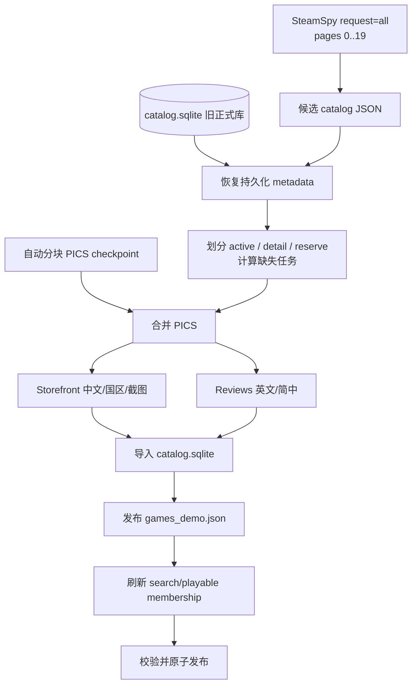

# SteamGuess 数据抓取与周更流水线

本文是当前生产脚本的维护说明。正式周更只使用这个入口：

```bash
./scripts/ops/run_weekly_catalog.sh
```

只有终端出现 `WEEKLY CATALOG READY`，暂存版本才会替换正式数据；成功后不需要再手动“落库”。

## 1. 当前架构



正式数据职责：

```text
data/catalog/catalog.sqlite
  唯一持久化真源：游戏、metadata、难度和玩家反馈聚合

data/catalog/steamspy_candidates.json
  本周规范化候选快照：流水线输入/中间产物

public/games_demo.json
  唯一网页搜索快照：单人和多人共同使用；其中带有效难度的条目构成答案池

data/runtime/steamguess.sqlite
  玩家、对局和反馈；与 catalog.sqlite 分离
```

难度管理页面直接通过 Admin API 读写 `catalog.sqlite`。旧的
`labeling_catalog.json` 和浏览器 localStorage 标签流程已经废弃。

难度管理页中的“不适合/太冷门”写入 `games.pool_status`。该状态不会被
SteamSpy 周更覆盖；Active 选池会先跳过这些 AppID，再应用数量上限，因此
后续排名游戏会自动补位。恢复操作只解除排除，不会强行把游戏塞入 Active。

## 2. 候选、Active、Search 与 Playable

- **候选库**：默认抓 SteamSpy `request=all` 的 0–19 页，通常约 20,000 个 AppID。
- **Active**：排除人工禁用项之后固定的 SteamSpy 排名窗口，默认 `STEAMGUESS_ACTIVE_LIMIT=1000`。
- **Detail**：保证执行 PICS、Storefront、评论补全的窗口，默认 `STEAMGUESS_DETAIL_LIMIT=4000`。
- **Reserve**：其余候选，保留在 SQLite 中备用。
- **Search**：所有非 `excluded` 游戏都可以被搜索；Active 主要控制本周题库窗口。
- **Playable**：Search 中带有有效难度、可以被随机选为正确答案的游戏。

固定关系为：

```text
Playable ⊆ Search ⊆ Active
```

因此 `active=1000` 不代表数据库只有 1000 条，也不代表所有搜索结果都有难度。
`pool_status` 才是是否可搜索/可出题的唯一规则；`heat_rank` 只用于展示。

## 3. 数据来源

### SteamSpy

`discover_steamspy.py` 获取候选发现和热度相关字段，并保存逐页 raw checkpoint。SteamSpy 不是中文名、截图、厂商或正式标签的唯一来源。

### PICS

周更默认匿名登录 Steam，并只为 Detail 窗口中缺失 PICS 数据的 AppID
执行抓取。抓取按 500 款分块保存到 staged workspace，失败后重跑会复用
已完成分块。

也可以显式传入准备好的 PICS snapshot：

```bash
STEAMGUESS_PICS_FILE=data/raw/pics/example.json \
./scripts/ops/run_weekly_catalog.sh
```

它主要补充应用类型、排序后的用户标签和 change number。不传入时，流水线会保留 SQLite/旧 catalog 中已知的 PICS metadata，而不会用空值覆盖。

### Storefront

`enrich_storefront.py` 按 AppID 补充：

- 简体中文名称及搜索别名；
- 国区可用性与人民币常态价格；
- 开发商、发行商、发行日期；
- Storefront 类型和全部可用截图。

数据库不保存当前折扣价和折扣比例作为 canonical 字段。

### Steam Reviews

`enrich_reviews.py` 获取英文、简体中文各最多 100 条评论。每种语言独立 checkpoint；临时网络错误按配置重试，默认不允许在仍有失败时发布部分结果。

### LiteLLM 评论清洗 sidecar

评论清洗不会覆盖原始评论。`redact_reviews_ai.py` 在真正发起请求时才延迟
加载 LiteLLM，因此供应商可替换，测试和 `--dry-run` 不要求安装 LiteLLM
或访问网络。任务按固定顺序选择，并逐条写入可恢复的 JSONL checkpoint：

```text
data/analysis/review-redaction/review_redactions.jsonl
```

常用的一体化命令：

```bash
STEAMGUESS_REDACTION_MODEL=provider/model \
STEAMGUESS_REDACTION_SCOPE=detail \
STEAMGUESS_REDACTION_REVIEWS_PER_LANGUAGE=100 \
STEAMGUESS_REDACTION_IMPORT_DB=data/catalog/catalog.sqlite \
./scripts/ops/run_review_redaction_ai.sh
```

重跑同一命令会通过 `--resume` 跳过模型、Prompt 版本和原文 hash 均未变化的
成功项。也可以把 checkpoint 单独导入：

```bash
python3 -m scripts.catalog.import_review_redactions \
  --input data/analysis/review-redaction/review_redactions.jsonl \
  --db data/catalog/catalog.sqlite
```

导入器会安全创建或校验 `review_redactions` 表，并通过评论 hash 拒绝过期
结果。发布器优先使用匹配的 sidecar 文本，输出到
`public/games_demo.json` 的 `hints.reviewTexts[]`；`app_reviews` 中的原文始终
保留。只有导入并重新执行发布后，前端才会看到新的清洗结果。

## 4. 周更安全机制

`scripts/ops/run_weekly_catalog.sh` 会：

1. 使用 `flock` 防止两个周更同时运行；
2. 在 `data/catalog/.weekly-work/current/` 建立持久化暂存区；
3. 首次运行时复制上一版 catalog、SQLite、Search 快照和 Storefront state；
4. 复用 SteamSpy raw 页、Storefront state、JSON 内的评论 checkpoint；
5. 失败或手动终止时保留整个暂存区；
6. 重跑同一命令时自动恢复；
7. 校验 staged catalog、SQLite、标签和难度；
8. 备份旧 catalog/SQLite 后原子替换正式文件；
9. 默认保留最近 28 份 catalog/SQLite 备份。

不要在准备恢复时删除：

```text
data/catalog/.weekly-work/current/
```

如果要放弃整次 staged run，应先确认无需其中已经抓取数小时的数据，再手动移走或删除该目录。

## 5. 常用参数

```bash
STEAMGUESS_ACTIVE_LIMIT=1000 \
STEAMGUESS_DETAIL_LIMIT=4000 \
STEAMGUESS_STEAMSPY_INTERVAL=120 \
STEAMGUESS_STEAMSPY_RETRIES=2 \
STEAMGUESS_STEAMSPY_RETRY_DELAY=30 \
STEAMGUESS_STOREFRONT_DELAY=5 \
STEAMGUESS_REVIEWS_DELAY=5 \
STEAMGUESS_REVIEWS_RETRIES=3 \
STEAMGUESS_REVIEWS_RETRY_DELAY=30 \
./scripts/ops/run_weekly_catalog.sh
```

主要变量：

| 变量 | 默认值 | 含义 |
|---|---:|---|
| `STEAMGUESS_ACTIVE_LIMIT` | `1000` | SteamSpy Active 排名窗口 |
| `STEAMGUESS_DETAIL_LIMIT` | `4000` | 必须补齐详细 metadata 的排名窗口 |
| `STEAMGUESS_AUTO_PICS` | `1` | 自动抓取缺失 PICS metadata |
| `STEAMGUESS_PICS_CHUNK_SIZE` | `500` | PICS checkpoint 分块大小 |
| `STEAMGUESS_STEAMSPY_INTERVAL` | `120` | SteamSpy 页间隔秒数 |
| `STEAMGUESS_STOREFRONT_DELAY` | `5` | Storefront 请求间隔 |
| `STEAMGUESS_REVIEWS_DELAY` | `5` | 评论请求间隔 |
| `STEAMGUESS_CATALOG_WORK_DIR` | `data/catalog/.weekly-work` | 可恢复暂存根目录 |
| `STEAMGUESS_CATALOG_DB_PATH` | `data/catalog/catalog.sqlite` | 正式 catalog DB |
| `STEAMGUESS_CATALOG_PATH` | `data/catalog/steamspy_candidates.json` | 正式候选快照 |
| `STEAMGUESS_PLAYABLE_PATH` | `public/games_demo.json` | 正式 Search 运行快照；变量名为历史兼容名称 |
| `STEAMGUESS_PICS_FILE` | 空 | 可选 PICS snapshot |

从已有候选快照运行、跳过 SteamSpy：

```bash
STEAMGUESS_WEEKLY_FROM_EXISTING=1 ./scripts/ops/run_weekly_catalog.sh
```

跳过全部 enrichment 只适合快速验证发布链，不是完整周更：

```bash
STEAMGUESS_WEEKLY_FROM_EXISTING=1 \
STEAMGUESS_WEEKLY_SKIP_ENRICHMENT=1 \
./scripts/ops/run_weekly_catalog.sh
```

## 6. 增量与恢复规则

- `enrichment_jobs` 是任务/恢复提示，不是 metadata 真源。
- Active 与 Detail 相互独立；补全 Top 4000 不会把正式 Search 或答案池扩成 4000。
- planner 同时检查当前 active 行是否真的缺字段，避免“job complete 但字段丢失”被错误跳过。
- import 使用 upsert，新的空值不会清除已有标签、公司、日期、截图或评论。
- Storefront state 和评论结果持续写入 staged 文件；脚本中断后可从已完成 AppID 继续。
- SteamSpy 每页成功后立刻保存 raw 文件；`--resume` 会复用已完成页。
- PICS 每个分块成功后保存独立 snapshot；重跑不会重新请求已完成分块。
- 发布器可从 staged SQLite 恢复持久化 PICS 标签，但正确目标仍是规范化 catalog 同时保留这些字段；release validation 会检查二者一致。

## 7. 难度管理与发布

难度唯一真源是 SQLite 的 `games` 表：

```text
games.difficulty_manual_score  人工分
games.difficulty_locked        是否锁定最终值
games.difficulty_score          当前生效分
games.player_feedback_*         玩家反馈聚合统计
```

候选顺序严格沿用 SteamSpy `request=all` 的页面与响应顺序，不再计算或保存
额外的热度评分来重排候选。

管理页面：

```text
/labeler
→ GET /api/admin/difficulties
→ PUT /api/admin/difficulties/:appid
```

没有有效难度的游戏仍可搜索，但不能成为答案。未锁定人工分是编辑中的当前
值；锁定后不会被玩家反馈同步覆盖。周更不会自动调用 AI 服务。

玩家反馈从 runtime DB 同步回 catalog DB：

```bash
./scripts/ops/update_difficulty_from_feedback.sh
```

该任务只采纳每个玩家对同一游戏的最新有效反馈，并使用最小样本数、方差
阈值、先验权重和单次最大变化限制。结果聚合后直接写回
`games.player_feedback_*`，并更新未锁定行的 `difficulty_score`。
公开有效难度的规则为：

```text
锁定人工分：保持人工分
未锁定人工分：可由玩家反馈聚合结果更新
没有人工分或有效反馈：暂不进入答案池
```

同步完成后需要重新发布 `games_demo.json`（可由后续周更完成），反馈分才会
进入网页运行快照；原始玩家反馈仍保存在 `data/runtime/steamguess.sqlite`。

### 入门难度与开局提示

`beginner` 对应严格的 **0–14 分**。入门局可以在第一次猜测前免费展示一项
开局提示：模糊截图或已经脱敏的评论。这个免费开局提示属于难度规则，不计入
玩家主动点击“提示”产生的提示次数；之后从提示菜单主动获取的内容仍按普通
提示处理。

发布字段为：

```text
hints.screenshotUrls[]   全部可用截图 URL
hints.reviewTexts[]      发布时选用的脱敏评论
```

## 8. 检查、测试与历史文件

查看数据库：

```bash
npm run data:catalog-status
npm run db:backup-catalog
```

验证代码：

```bash
npm run test:data
npm run build
```

脚本分类：

- `scripts/catalog/`：当前生产流水线；
- `scripts/ops/`：生产包装、校验、备份和运维；
- `scripts/experimental/`：实验，不得被生产入口依赖；
- `scripts/legacy/`：历史参考，已废弃，不得从 `package.json`、Makefile 或周更入口调用。

已废弃并删除的旧产物包括 `public/labeling_catalog.json`、旧难度拟合脚本、
AI 难度候选脚本、浏览器 localStorage 难度代码，以及旧的难度 side tables。
旧难度拟合链路不再参与抓取、发布或运行时逻辑。

`data/logs/` 中出现 `publish_labeling` 或 `labeling_catalog.json` 属于过去运行的不可变日志，不代表当前架构。不要为了“清理引用”篡改历史日志。

旧的 `data/catalog/catalog.sqlite.gz` 和 `bootstrap-manifest.json` 也已废弃：
它们固化了旧 schema、旧 membership 和 997 款游戏快照。数据库跨机器迁移
应使用 `npm run db:backup-catalog` 生成一致性备份，再单独传输或恢复数据卷，
不要把持续增长的 SQLite 数据库重新提交进 Git。

### 生产共享卷

生产服务器必须在共享持久卷维护：

```text
/app/data/catalog/catalog.sqlite
```

`STEAMGUESS_CATALOG_DB_PATH` 应指向该路径。不要依赖容器镜像内预置或容器
临时文件系统中创建的数据库；镜像替换后这些内容可能消失。多实例部署时，
所有实例必须挂载并读取同一份 catalog 数据库，确保周更结果、人工锁定、
玩家反馈汇总和评论清洗 sidecar 一致。
